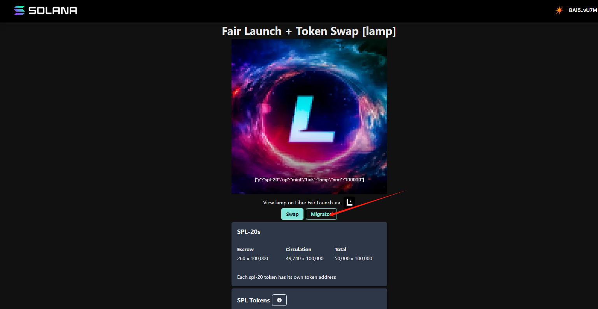
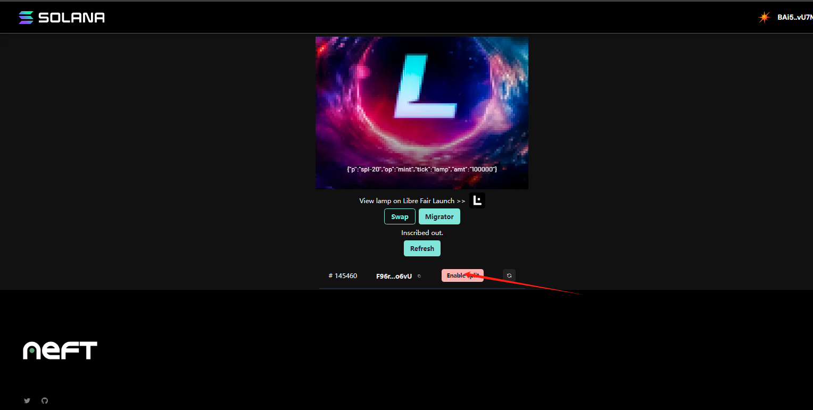
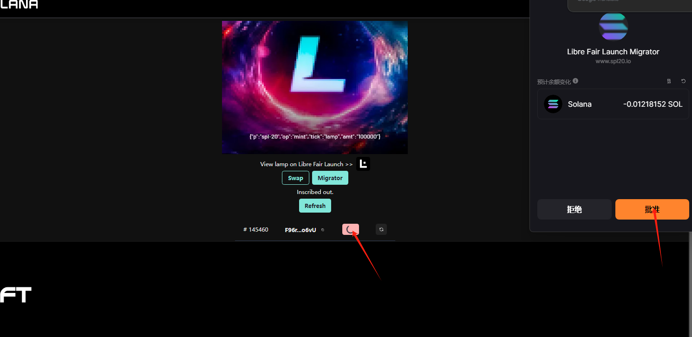
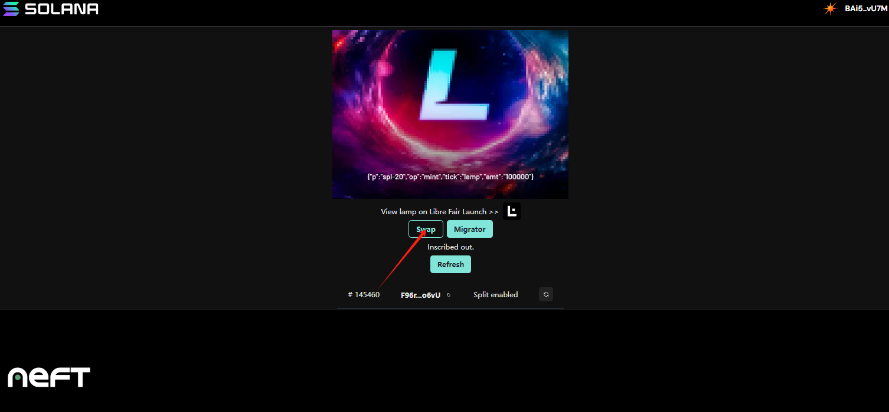
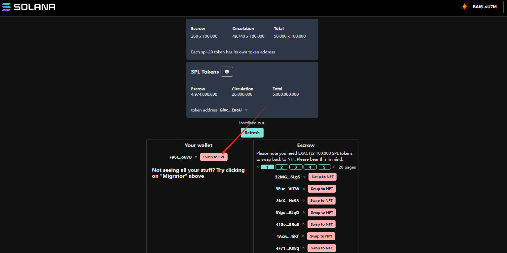
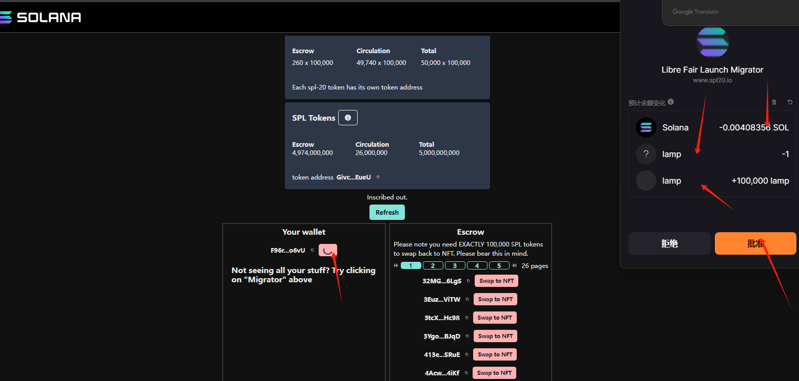
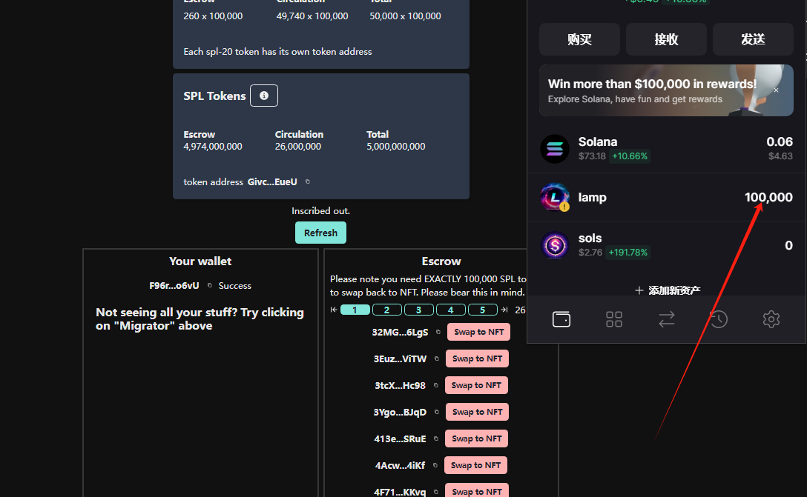

# Splitting Tutorial

## Download Solflare Wallet

[solflare Wallet](https://solflare.com)

## Import the mnemonic phrase of the wallet where your NFT is located

## Login Split URL

[SPL20 lamp](https://www.spl20.io/libremigrator/DsZctg26EvJdh9nZZrPU8QL6WBWzayBmeMj7LErbgt7R)

### 1. migrator

### 2. Enable split

- Select the NFT you want to split.
- Click on "Enable split."
- Wallet signature.
  
   
  

### 3. swap

- Click on "swap" and scroll down.
- Click on "swap to spl"
   
  
   
  
   
  
- Wallet approval confirmation
- Split completed
   
  
