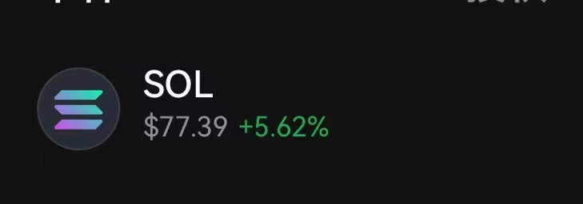
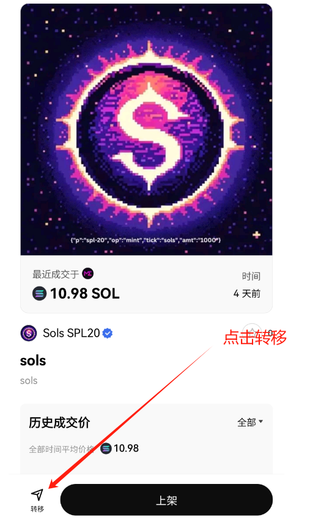
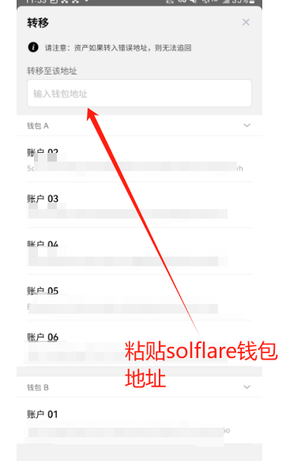
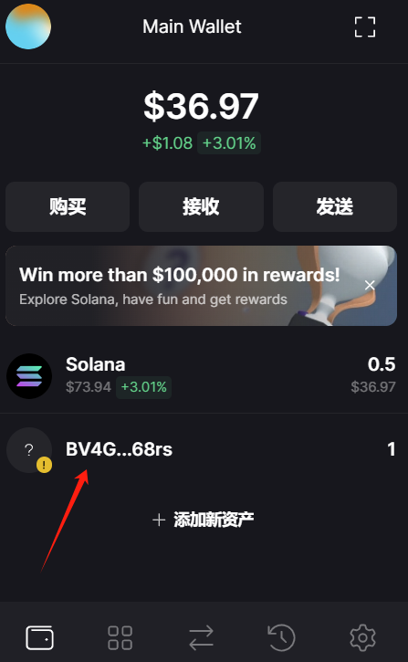

# Splitting Tutorial

## Download Solflare Wallet

[solflare Wallet](https://solflare.com)

## Deposit SOL to Wallet (Transaction Fee)

## Transfer SOLS NFT

To transfer SOLS NFT to a wallet, if purchased from OK Exchange, directly send the NFT to Solflare wallet.

## Ensure that the NFT is received in the Solflare wallet

## Login Split URL

[ URL](https://www.spl20.io/libremigrator/DGn2nHnGqLucsfZiVgvJy4MFShkJJskHdix7WQ4eezQF)

### 1. migrator

### 2. Enable split

- Select the NFT you want to split.
- Click on "Enable split."
- Wallet signature.
  

### 3. swap

- Click on "swap" and scroll down.
- Click on "swap to spl"
   
  
- Wallet approval confirmation
- Split completed
   
  
