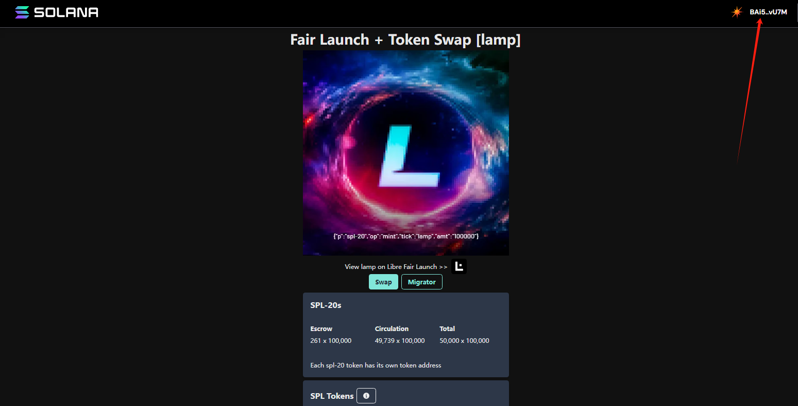

# 合成

[spl20 lamp 拆分合成地址](https://www.spl20.io/libremigrator/DsZctg26EvJdh9nZZrPU8QL6WBWzayBmeMj7LErbgt7R)

### 步骤如图

#### 连接钱包（solflare）

- 不支持幻影和 okx web3
- 点击 migrator 刷新(refresh)
   
  

- 需要准备 1000 个 sols Token

