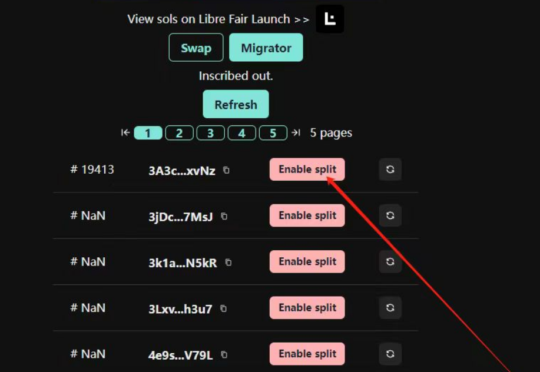
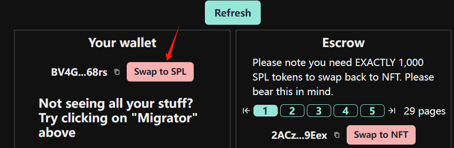
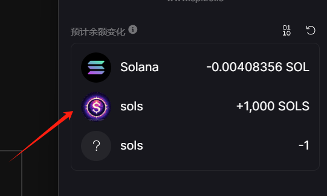

# 拆分教程

## 1.下载 solflare 钱包

[solflare 钱包](https://solflare.com)

## 2.导入你的 NFT 所在钱包的助记词

## 3.登录拆分网址

[spl20 拆分网址](https://www.spl20.io/libremigrator/DGn2nHnGqLucsfZiVgvJy4MFShkJJskHdix7WQ4eezQF)

### 3.1 migrator

### 3.2 Enable split

- 选择你想要拆分的 NFT
- 点击 Enable split,
- 钱包签名
  

### 3.3 swap

- 返回 swap,下滑
- 点击 swap to spl
   
  
- 钱包批准确认
- 拆分完成
   
  
