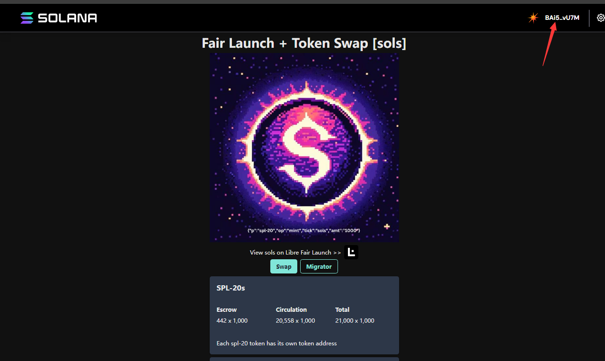

# 合成

[spl20 拆分合成地址](https://www.spl20.io/libremigrator/DGn2nHnGqLucsfZiVgvJy4MFShkJJskHdix7WQ4eezQF)

### 步骤如图

#### 连接钱包（solflare）

- 不支持幻影和 okx web3
   
  

- 点击 migrator 刷新(refresh)
   
  

- 需要准备 1000 个 sols Token

#### SOLS 代币 合约

2wme8EVkw8qsfSk2B3QeX4S64ac6wxHPXb3GrdckEkio

