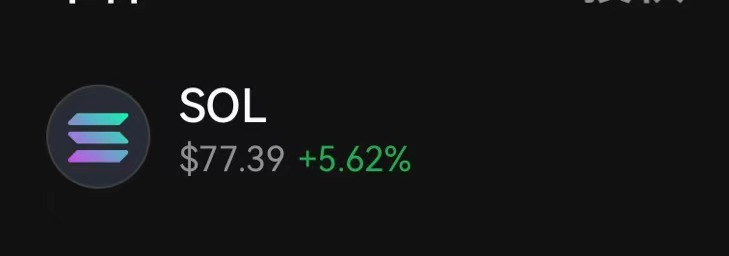
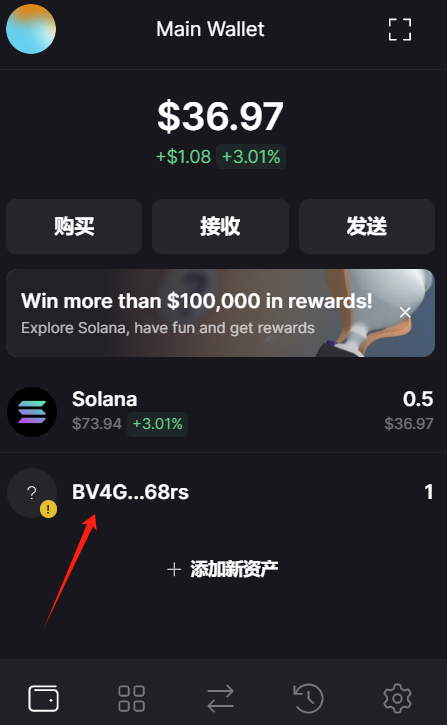

# 拆分教程

## 1.下载 solflare 钱包

[solflare 钱包](https://solflare.com)

## 2.充值 sol 到钱包(手续费)

## 3.转移 SOLS NFT

将 sols NFT 转至钱包中，若是 OK 交易所买的，直接发送 NFT 到 solflare 钱包中

## 4. 确保 NFT 到账 solflare 钱包中

## 5.登录拆分网址

[spl20 拆分网址](https://www.spl20.io/libremigrator/DGn2nHnGqLucsfZiVgvJy4MFShkJJskHdix7WQ4eezQF)

### 5.1 migrator

### 5.2 Enable split

- 选择你想要拆分的 NFT
- 点击 Enable split,
- 钱包签名
  

### 5.3 swap

- 点击 swap,下滑
- 点击 swap to spl
   
  
- 钱包批准确认
- 拆分完成
   
  
